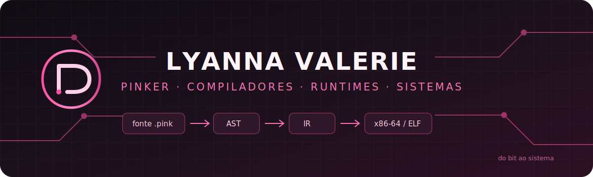

<div align="center">



<br>

# Lyanna Valerie

### Linguagens, compiladores e sistemas construídos de baixo para cima.

[](https://github.com/LyannaValerie/pinker-v0)


</div>

---

## `01.` Pesquisa em andamento

Sou pesquisadora e desenvolvedora independente. Meu trabalho conecta matemática, lógica e arquitetura de computadores à construção concreta de linguagens, compiladores, runtimes e sistemas operacionais.

```text
lógica booleana
    ↓
circuitos e arquitetura
    ↓
assembly e representação de máquina
    ↓
compiladores, runtimes e ABIs
    ↓
sistemas operacionais e self-hosting
```

Não estudo essas camadas como assuntos isolados. O objetivo é compreender os contratos entre elas e transformar esse entendimento em ferramentas e sistemas autorais.

---

## `02.` Pinker

> Uma linguagem de programação autoral em português, concebida para ser tecnicamente auditável, lexicalmente soberana e capaz de crescer até controlar a própria implementação.

[**`pinker-v0`**](https://github.com/LyannaValerie/pinker-v0) é a base factual atual da linguagem:

- frontend e compilador escritos em **Rust**;
- interpretador para a superfície estável;
- AST tipada, IR textual, CFG IR e máquina abstrata auditáveis;
- backend nativo próprio;
- geração de executáveis **ELF Linux x86-64 System V**;
- runtime nativo `pinker_rt`;
- verificação de paridade entre execução interpretada e nativa nos recortes compatíveis.

```text
fonte .pink
  └─► lexer / parser com spans
       └─► AST tipada e validada
            └─► IR textual / CFG IR
                 └─► máquina abstrata
                      ├─► interpretador
                      └─► assembly x86-64
                           └─► ELF + pinker_rt
```

### Pequeno fragmento da linguagem

```pinker
pacote laboratorio;

carinho principal() -> bombom {
    falar("uma linguagem deve conhecer a máquina que a sustenta");
    retornar 0;
}
```

> **Estado honesto:** Pinker v0 ainda não é uma linguagem de propósito geral nem um compilador de produção. O alvo nativo atual é Linux x86-64 System V. Self-hosting, freestanding e sistema operacional pertencem à direção futura, não ao estado já implementado.

---

## `03.` Três responsabilidades

<table>
<tr>
<td width="33%" valign="top">

### Engine

Implementação factual:

- compilador;
- interpretador;
- IRs;
- backend;
- runtime;
- testes;
- ferramentas.

</td>
<td width="33%" valign="top">

### Rosa

Direção e julgamento:

- identidade;
- vocabulário;
- intenção;
- coerência;
- soberania lexical;
- verdade técnica.

</td>
<td width="33%" valign="top">

### Guardião Pinker

Verificação determinística:

- contratos;
- invariantes;
- conformidade;
- critérios de evolução;
- separação entre fato e visão.

</td>
</tr>
</table>

---

## `04.` Laboratório técnico

```text
Pinker/
├── linguagens de programação
├── compiladores e interpretadores
├── sistemas de tipos e semântica
├── IR, CFG e geração de código
├── runtimes, ABIs e formatos binários
├── arquitetura de computadores
├── assembly, C e Rust
├── Linux From Scratch e OSDev
├── segurança e sistemas de baixo nível
└── agentes de IA para engenharia de software
```

Também estudo a linha contínua do **Nand2Tetris**:

```text
NAND → circuitos → CPU → assembly → VM → compilador → sistema
```

---

## `05.` Princípios de construção

```rust
struct Pesquisa {
    verdade_tecnica: Evidencia,
    abstracao: Contrato,
    implementacao: Sistema,
    identidade: Intencao,
}

fn evoluir(projeto: &mut Projeto) {
    localizar();
    inspecionar();
    extrair();
    classificar();
    planejar();
    alterar();
    validar();
    revisar();
    relatar();
}
```

- visão não é tratada como implementação;
- abstrações devem preservar os contratos das camadas inferiores;
- uma entrega precisa atravessar o caminho completo, não apenas aparentar progresso;
- nomes fazem parte da arquitetura;
- ferramentas devem ampliar autonomia, não esconder funcionamento.

---

## `06.` Projetos públicos

<a href="https://github.com/LyannaValerie/pinker-v0">
  
</a>
<a href="https://github.com/LyannaValerie/mapinhas">
  
</a>

---

<div align="center">


### `do bit ao sistema · da ideia ao contrato · do contrato à máquina`

**Construindo Pinker sem esconder as camadas que tornam uma linguagem possível.**

</div>
